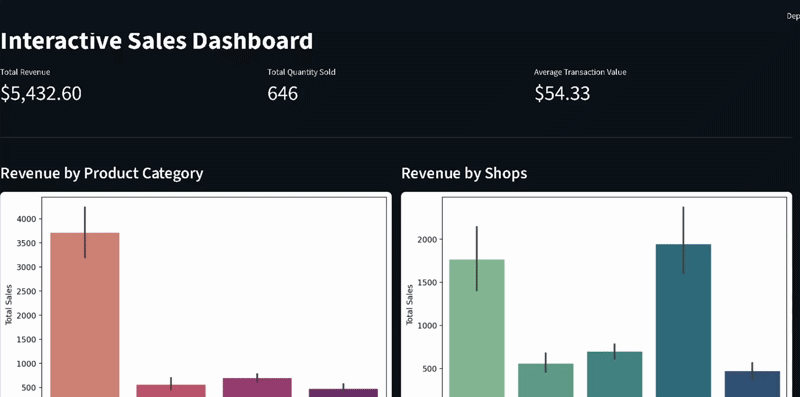

# 📊 Interactive Sales Executive Dashboard

## Project Overview
This project is an end-to-end data visualization solution designed to provide both **High-Level Executive Summaries** and **Granular Product Deep-Dives**. By combining the statistical power of **Seaborn** with the interactivity of **Plotly**, this dashboard allows users to identify broad sales trends and investigate specific product performance with a single click.

---

## 🎥 Dashboard Preview


---

## 🚀 Key Features
* **Global KPI Metrics:** Real-time calculation of Total Revenue, Total Quantity, and Average Transaction Value.
* **Fixed Strategic Overview:** Static Seaborn visualizations showing Revenue by Category and Shop Performance that remain consistent for baseline comparison.
* **Interactive Deep-Dive Section:** Custom-built button navigation that filters specific Plotly and Seaborn visuals for a selected product category.
* **Drill-Down Capabilities:** Interactive Plotly scatter plots with hover data for detailed product-level analysis.

---

## 🛠️ Technical Skills Acquired
* **Seaborn Mastery:** Advanced use of `subplots` to create multi-plot grids and complex statistical charts (Box plots, Violin plots, and Heatmaps).
* **Interactive Plotting:** Implementation of **Plotly Express** for dynamic scatter plots to visualize hierarchical data.
* **Dashboard Architecture:** Building a stateful web application using **Streamlit**, managing "memory" with `st.session_state`, and optimizing performance with `@st.cache_data`.
* **UI/UX Design:** Designing a logical flow from "Global Overview" to "Local Analysis" without the need for cluttered sidebars.

---

## 💻 Development Workflow & AI Collaboration
In the spirit of professional transparency and modern development practices, this project was built using a **Pair Programming** approach with AI:

1.  **Architecture & Logic:** I designed the dashboard's hierarchy, determined the relationship between fixed and filtered visuals, and established the data flow logic.
2.  **Statistical Analysis:** I manually performed the initial data exploration and statistical calculations using Pandas and Seaborn in `dashboard.ipynb`.
3.  **Frontend Implementation:** I collaborated with an AI assistant to rapidly translate my architectural requirements into Streamlit code. Specifically, I provided detailed prompts for the button-trigger logic and session-state management to ensure a smooth user experience.
**the prompt i gave is:**

```prompt

okay the layout and the charts i will say at once. read carefully and give a small summary on what u understood then when i say code u code.

1. i don't need side bars.
2. the total revenue, total quantity and avg spent section is good keep it below the title of the chart.
3. the coding part should be after the loading of dataset(name :df)
4. the first top section, a chart for total revenue by product category, beside that, the rgt side, another chart to show the total revenue by shops
5. now the filtering part, as we only have a 4 product category type lets make a button for each type when clicked the charts below them will change(note: the above charts i mentioned should not changed.)

6.the charts where the filtering happens:
visual 1 : a card to show the total revenue of that selected product category.(metric card or KPI card)
visual 2:  beside the total revenue card, place another card to show the total qunatity sold.
visual 3: the chart, after or below the cards a chart hmmm a plotly scatter plot to show the product details: having the quantity sold, price per unit, shop name,  product name, total sales.
visual 4: another chart beside that scatter plotly chart, rgt side, a bar chart to show the top 3 product of the selected product category.

```

---

## 📂 Project Structure
```
.
├── visualizations/               #folder for static charts
├── dashboard.ipynb               #anaylsis notebook
├── dashboard.py                  #dashboard site
├── requirements.txt  
├── sales_data.csv                #dataset
└── Seaborn_notes.ipynb           #practised notebook
├── dashboard_demo.gif            #dashboard site GIF

```

---

## How to Run
1. Clone this repository.
2. Install dependencies: `pip install -r requirements.txt`
3. Run the dashboard: `streamlit run dashboard.py`
---
